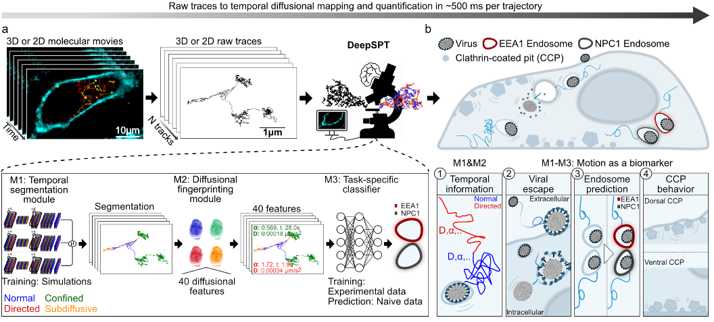

# DeepSPT
## Deep learning assisted Single Particle Tracking for automated correlation between diffusion and function
DeepSPT, a deep learning framework to interpret the diffusional 2D or 3D temporal behavior of objects in a rapid and efficient manner, agnostically. DeepSPT is a deep learning framework, encompassing three sequentially connected modules: A temporal behavior segmentation module; a diffusional fingerprinting module; and a task-specific downstream classifier module (Fig. 1a). The first two modules are universal, applicable directly to any trajectory dataset characterized by x, y, (z) and t coordinates across diverse biological systems. The final module capitalizes on experimental data to learn a task that is specific to the system under investigation.


### Citing
TBA

### Usage
#### Installation
DeepSPT's installation guide utilize conda environment setup, therefore either miniconda or anaconda is required to follow the bellow installation guide.
 - Anaconda install guide: [here](https://www.anaconda.com/download)
 - Mini conda install guide: [here](https://docs.conda.io/en/latest/miniconda.html)

DeepSPT is most easily setup in a new conda environment with dependecies and channels found in dependency.yml - Open Terminal / Commando prompt at wished location of DeepSPT and run the bash commands below, which creates the environemnt, downloades and installs packages, in less than 5 minutes.

```bash
git clone https://github.com/JKaestelHansen/DeepSPT
cd DeepSPT
conda env create -f environment_droplet.yml
conda activate DeepSPT
pip install probfit==1.2.0
pip install iminuit==2.11.0
```
DeepSPT modules and additional/helpful functions are contained in the `deepspt_src` folder.
When running/building scripts in the DeepSPT directory modules are imported as:
```python
from deepspt_src import *

```
Three test python scripts are provided:
  - `simulate_diffusion.py` - Data generation of 2D or 3D diffusion of heterogeneous/homogeneous motion.
  - `usage_example1.py` - Usage example for loading numpy array saved as pickle or csv file.
  - `usage_example1.py` - Usage example for the three DeepSPT modules: Temporal segmentation, diffusional fingerprinting and task-specific classifier module on simulated data.
  - `usage_example2.py` - Work in progress WIP: Usage example for the three DeepSPT modules: Temporal segmentation, diffusional fingerprinting and task-specific classifier module for time-resolved classification on simulated data.

### For demostration
For demostration regarding presented data and analysis contained in the manuscript, please refer to the `_For_puplicaiton` folder where you will find the required information and scripts. To run on the same data download the data as outlined below.

### Data
  - Your own: DeepSPT accepts csv files or numpy arrays of shape (number of tracks, x,y,(z)).
  - Simulated data: simulate_diffusion.py, usage_example.py, and usage_example2.py (WIP) contains functions to simulate trajectories.
  - To access data of the publication "Deep learning assisted Single Particle Tracking for automated correlation between diffusion and function" please download from: TBA

### Files
  - For_publication: Scripts as used in "Deep learning assisted Single Particle Tracking for automated correlation between diffusion and function". Folders with data and precomputed files are available, see Data.
  - _Images: Contains figure seen in Readme. Copyrighted as detailed in journal carrying "Deep learning assisted Single Particle Tracking for automated correlation between diffusion and function".
  - deepspt_mlflow_utils: MLflow helper functions
  - deepspt_src: Source code for DeepSPT
  - environment_droplet.yml: requirements file for installation of virtual environment.

### Contact

Jacob Kæstel-hansen, PhD fellow\
Department of Chemistry\
jkh@chem.ku.dk

or commit an issue to this github. 
